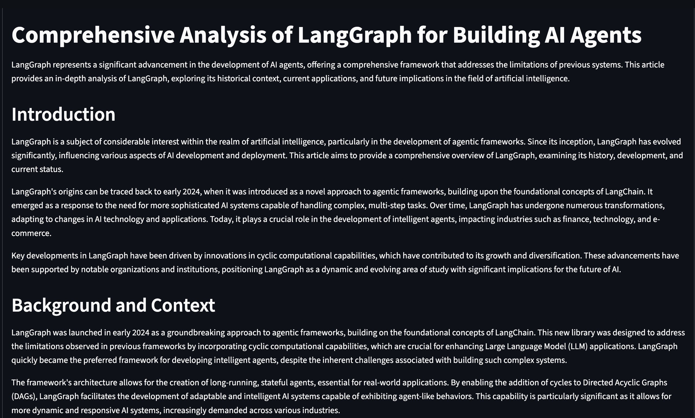

Template for creating and submitting MAT496 capstone project.

# Overview of MAT496

In this course, we have primarily learned Langgraph. This is helpful tool to build apps which can process unstructured `text`, find information we are looking for, and present the format we choose. Some specific topics we have covered are:

- Prompting
- Structured Output 
- Semantic Search
- Retreaval Augmented Generation (RAG)
- Tool calling LLMs & MCP
- Langgraph: State, Nodes, Graph

We also learned that Langsmith is a nice tool for debugging Langgraph codes.

------

# Capstone Project objective

The first purpose of the capstone project is to give a chance to revise all the major above listed topics. The second purpose of the capstone is to show your creativity. Think about all the problems which you can not have solved earlier, but are not possible to solve with the concepts learned in this course. For example, We can use LLM to analyse all kinds of news: sports news, financial news, political news. Another example, we can use LLMs to build a legal assistant. Pretty much anything which requires lots of reading, can be outsourced to LLMs. Let your imagination run free.

-------------------------

# Project report Template

## Title: Automated Web Search and Article Generator

## Overview

Automates comprehensive web research and article generation. When a user provides a topic, the agent autonomously performs a multi-stage process:

Comprehensive Research: Uses Tavily to gather recent and relevant information from various high-quality sources

Multi-Perspective Analysis: Analyzes gathered information by asking critical questions from different angles (technical, historical, ethical, future implications)

Structured Synthesis: Synthesizes information into well-organized, Wikipedia-style articles with proper structure

Fact-Checking & Citation: Maintains a "working memory" of facts and sources, ensuring accuracy and verifiability

This project solves the problem of fragmented research tools by providing an end-to-end solution that transforms a simple query into a polished, structured article with proper citations.

## Reason for picking up this project

This project is perfectly aligned with the course content and comprehensively covers all major topics learned:

The entire research and writing process is naturally modeled as a stateful LangGraph application where:
Each node has a specific, isolated function
The state object carries context through the workflow

The graph structure makes the system debuggable with LangSmith and easily extensible

Course Topics Covered:
1. Prompting: Used throughout the workflow to guide LLM reasoning at each stage

2. Structured Output: Implemented using Pydantic models for consistent data structures (SearchResult, ResearchFact, ArticleOutline, etc.)

3. Semantic Search: Powers the research agent node for analyzing and retrieving relevant information

4. RAG (Retrieval Augmented Generation): Core to the research agent node for analyzing gathered data with multi-perspective analysis

5. Tool Calling LLMs & MCP: Integrates web search APIs (search tools) and web scraping tools for data collection

6. LangGraph Core Concepts:

  State: ResearchState TypedDict that evolves through the workflow

  Nodes: 7 specialized nodes (search, retrieve, research, outline, draft, synthesize, refine)

  Graph: Sequential workflow with clear state transitions

## Video Summary Link: 

Make a short -  3-5 min video of yourself, put it on youtube/googledrive, and put its link in your README.md.

- you can use this free tool for recording https://screenrec.com/
- Video format should be like this:
- your face should be visible
- State the overall job of your agent: what inputs it takes, and what output it gives.
- Very quickly, explain how your agent acts on the input and spits out the output. 
- show an example run of the agent in the video

## Plan

I plan to execute these steps to complete my project.

- [DONE] Setting up the project structure and defining the state schema
- [DONE] Implement the search node with Tavily tool integration
- [DONE] Build retrieval and parsing node for content extraction
- [DONE] Create the main research agent node
- [DONE] Implement the outline generation node for structured output
- [DONE] Build the draft node for section-wise content generation
- [DONE] Synthesis node for assembling together the article
- [DONE] Refinement node for quality check
- [DONE] Testing the workflow with various topics
- [DONE] Make frontend using streamlit for taking in input

## Conclusion:

I had planned to build a robust, autonomous Research Agent that could take a simple topic and perform comprehensive web research and article generation - the kind of deep, multi-source analysis that usually takes hours of manual work. My goal was to leverage the full power of LangGraph to create a sequential, stateful workflow that performs systematic research, analyzes information from multiple perspectives using RAG, and generates polished, Wikipedia-style articles with proper citations.

I think I have achieved this conclusion satisfactorily.

The reason for my satisfaction is that the final application is a genuinely functional research automation tool. I successfully implemented a comprehensive 7-node LangGraph workflow that autonomously performs each research stage: from web searching and content retrieval, through multi-perspective analysis using semantic search and RAG techniques, to structured outline generation, section drafting, and final article synthesis. The agent maintains a working memory of facts and sources throughout the process, ensuring the final output is not only informative but also verifiable through proper citations.

What makes me particularly satisfied is how well this project demonstrates the core concepts of the course. I implemented a true LangGraph application with proper state management, where the ResearchState object evolves through the entire workflow. Each node has a clear, isolated responsibility, making the system modular, debuggable with LangSmith, and easily extensible. The project successfully integrates all major course topics: from prompting and structured output with Pydantic models, to semantic search in the research phase, RAG for multi-perspective analysis, and tool calling for web search integration.

Overall, I'm satisfied with what I've built. It helped me revisit and practically implement all the topics I learned during this course. The project successfully transforms a simple topic query into a comprehensive, cited article through an automated, multi-stage process that demonstrates real-world application of LangGraph principles. While I recognize there's always room for enhancement (like adding more sophisticated search strategies or additional quality checks), the core functionality works as intended and provides a solid foundation for future extensions.

I may be a bit unsatisfied with the current simplicity of some components and wish I had more time to polish certain features, but given the constraints, I believe I've created a meaningful application that genuinely showcases the power of LangGraph for building complex, stateful AI workflows.

## Project Workflow

Landing page

Add the research topic and click Start Research

Final article which is available as download also

----------

# Added instructions:

- This is a `solo assignment`. Each of you will work alone. You are free to talk, discuss with chatgpt, but you are responsible for what you submit. Some students may be called for viva. You should be able to each and every line of work submitted by you.

- `commit` History maintenance.
  - Fork this repository and build on top of that.
  - For every step in your plan, there has to be a commit.
  - Change [TODO] to [DONE] in the plan, before you commit after that step. 
  - The commit history should show decent amount of work spread into minimum two dates. 
  - **All the commits done in one day will be rejected**. Even if you are capable of doing the whole thing in one day, refine it in two days.  
 
 - Deadline: Dec 2nd, Tuesday 11:59 pm

# Grading: total 25 marks

- Coverage of most of topics in this class: 20
- Creativity: 5
  